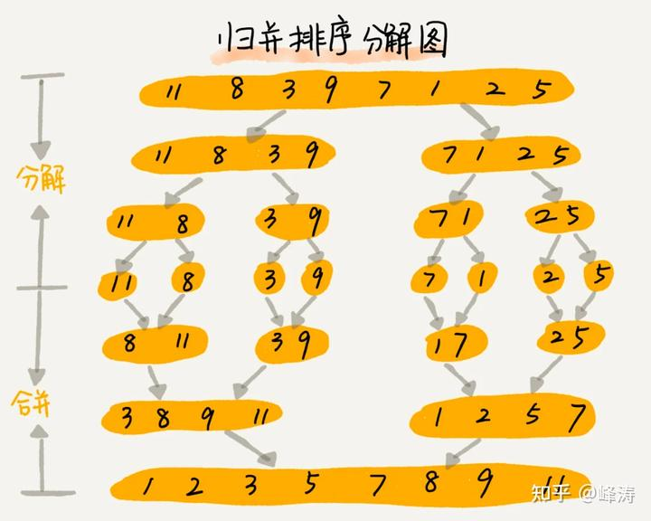
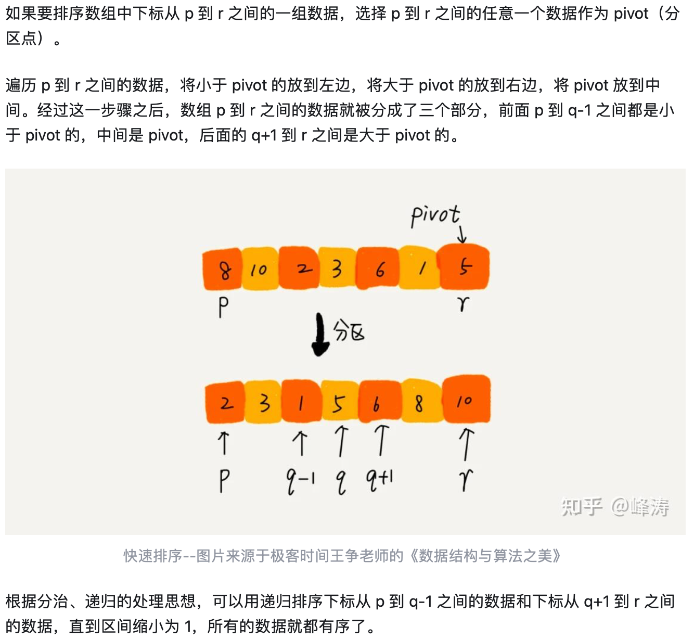

基础知识：快速排序（Quick Sort）， 归并排序（Merge Sort）的原理与代码实现。需要能讲明白代码中每一行的目的。快速排序时间复杂度平均状态下O（NlogN），空间复杂度O（1），归并排序最坏情况下时间复杂度O（NlogN），空间复杂度O（N）

* 入门题目：
* Leetcode 148. Sort List
* Leetcode 56. Merge Intervals
* Leetcode 27. Remove elements
* 进阶题目：
* Leetcode 179. Largest Number
* Leetcode 75. Sort Colors
* Leetcode 215. Kth Largest Element （可以用堆的解法替代）
* Leetcode 4. Median of Two Sorted Arrays

注意：后两题是与快速排序非常相似的快速选择（Quick Select）算法，面试中很常考


**归并排序和快速排序**

共同点：分治

**归并：**

排序一个数组，先把数组从中间分成前后两部分，然后对前后两部分分别排序，再将排好序的两部分合并在一起，这样整个数组就都有序了。



快排



```cpp

MergeSort(arr, left, right)
    if left < right
        mid = (left + right) / 2

        // Recursively divide the array into two halves
        MergeSort(arr, left, mid)
        MergeSort(arr, mid + 1, right)

        // Merge the sorted halves
        Merge(arr, left, mid, right)

Merge(arr, left, mid, right)
    n1 = mid - left + 1
    n2 = right - mid

    // Create temporary arrays
    L[1..n1], R[1..n2]

    // Copy data to temporary arrays L[] and R[]
    for i = 1 to n1
        L[i] = arr[left + i - 1]
    for j = 1 to n2
        R[j] = arr[mid + j]

    // Merge the temporary arrays back into arr[left..right]
    i = 1
    j = 1
    k = left
    while i <= n1 and j <= n2
        if L[i] <= R[j]
            arr[k] = L[i]
            i = i + 1
        else
            arr[k] = R[j]
            j = j + 1
        k = k + 1

    // Copy the remaining elements of L[], if any
    while i <= n1
        arr[k] = L[i]
        i = i + 1
        k = k + 1

    // Copy the remaining elements of R[], if any
    while j <= n2
        arr[k] = R[j]
        j = j + 1
        k = k + 1

```

```cpp
#快速排序
QuickSort(arr, low, high)
    if low < high
        // Partition the array, arr[p..q] such that elements less than or equal to arr[q] are on the left,
        // and elements greater than arr[q] are on the right.
        pivotIndex = Partition(arr, low, high)

        // Recursively sort the sub-arrays
        QuickSort(arr, low, pivotIndex - 1)
        QuickSort(arr, pivotIndex + 1, high)

Partition(arr, low, high)
    pivot = arr[high]
    i = low - 1

    // Iterate through the array and rearrange elements
    for j = low to high - 1
        if arr[j] <= pivot
            i = i + 1
            // Swap arr[i] and arr[j]
            Swap(arr[i], arr[j])

    // Swap arr[i + 1] and arr[high] to place the pivot in its correct position
    Swap(arr[i + 1], arr[high])
    return i + 1

```
